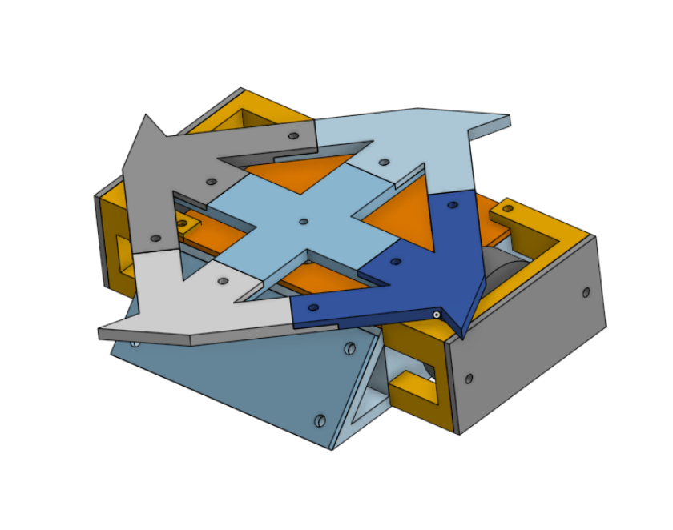
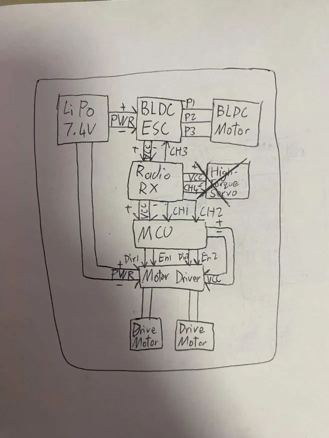
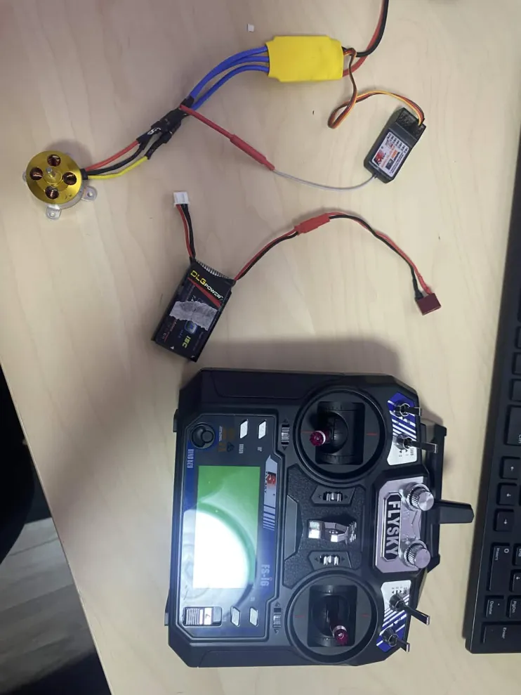
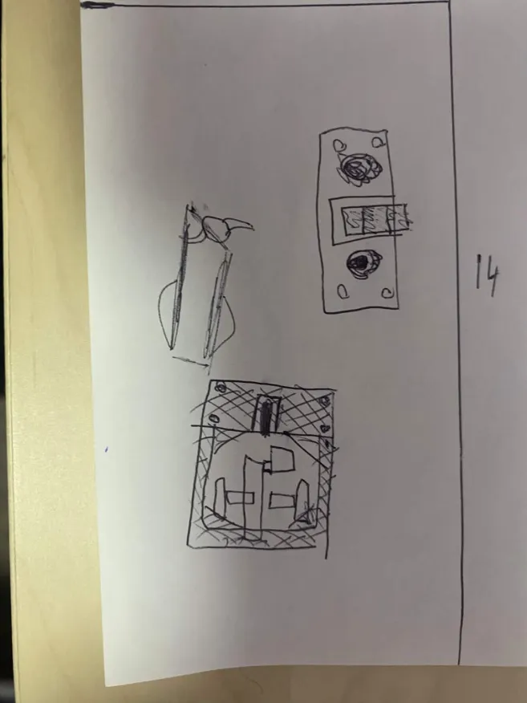
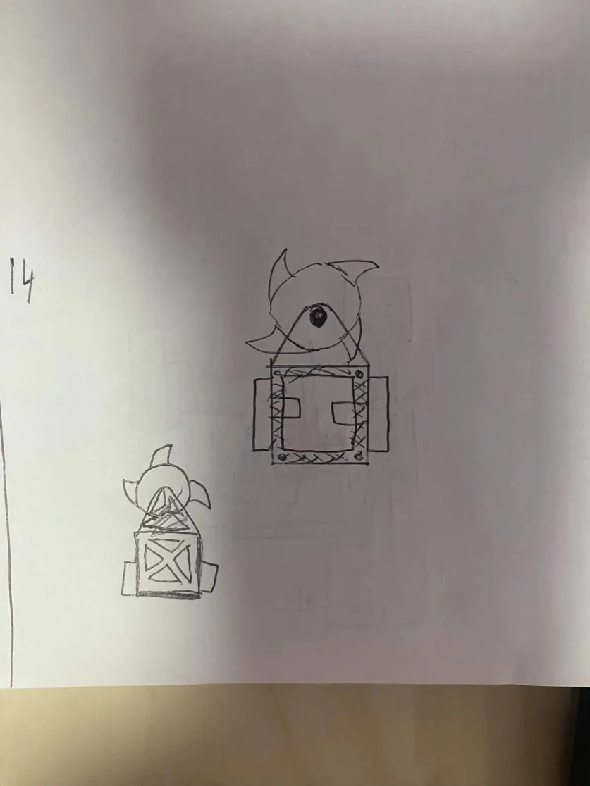
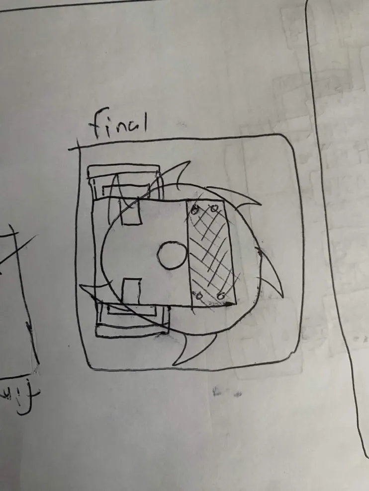
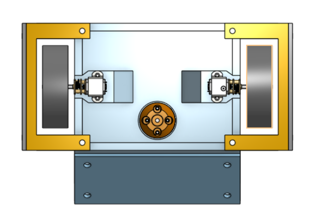
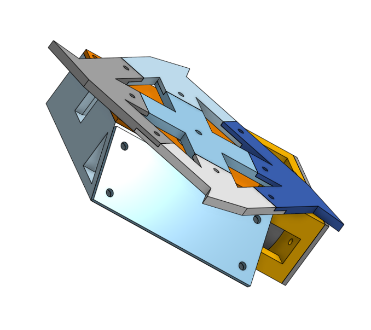
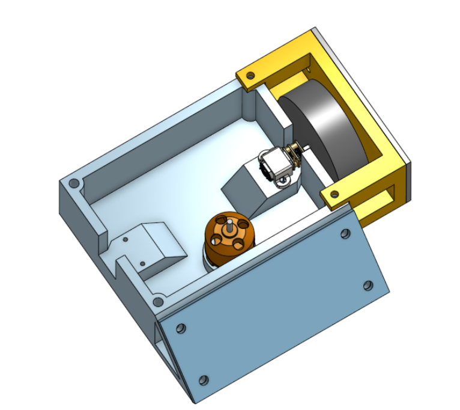
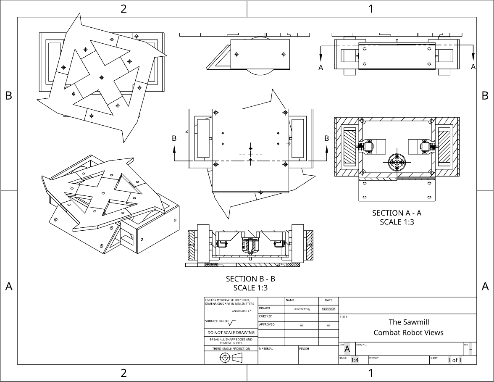

# The Sawmill
The Sawmill is an antweight combat robot I made for the funzies to introduce myself to the wonderful world of combat robotics! This is... THE SAWMILL!!!!!!!!!!!

Inspired by the Fingertech Viper with its horizontal spinner addon, the Sawmill is a wedge x horizontal spinner robot. If the blade decides to combust mid match, it's still a solid wedge bot!

(Disclaimer, this bot is not competetive, and would likely freaking explode in the box, it's made just for fun!)

It is primarily constructed from PLA, with M4 bolts and nuts for joining parts with heat set inserts, and aluminum plates to protect the vulnerable wheels and wedge.

## Design Planning
### Electronics
The electronics are basically your generic RC airplane stack combined with an Arduino Nano to control motors.

The Arduino nano essentially "hijacks" the signals from the Radio RX, and parses these signals to power a TB6612FNG Motor Driver, the drive motors are N20s geared for 700RPM, while the weapon motor is an A2212 BLDC motor at 2200KV (I know it's a bit fast for a weapon, but :P I no wann spend monny)

Electronics excluding Arduino Nano and N20s, basically your generic RC airplane stack.

### Robot Concept
I am a very indecisive person! It is a very common occurence in my life where the and second/third attempt at something is always the best, while the first is genuinely terrible... I first went for a vertical spinner.

The vertical spinner concept

After realizing the manufacturing complexity and how accurate my build has to be so the spinner doesnt vibrate itself to death, I decided to switch to a horizontal spinner like Tombstone.

The horizontal spinner concept

I tried this and even got 3 hours of CAD in, I realized it would also be hard to implement, and horizontal spinners like tombstone have the highest self-KO rate, and are NOT beginner friendly

Final concept.

I decided to go with my final design after a few hours of dilly-dallying, and I'm pretty happy with it

## CAD
After I dealt with that kerfuffle... I started the CAD!!! I used OnShape because OnShape is so amazingly BASED and easy to use and FREE! I'm also really familiar with OnShape, but I learned so much from this, especially in Assembly and Drawings!

Main body

Main body open hood

Part Studio

Part Studio open hood

### SUPER COOL CAD DRAWING!!!

**This was the coolest thing I learned how to do in OnShape!!!*

## Physical build

# Planning
I have assembled majority of the frame and the motors, they are all mounted using machine screws and washers. I have also machined a polycarbonate plate that I forgot to drill a hole in for the weapon shaft. Alongside that, all the electronics are fully complete and the control systems are packed efficiently into the frame. I have yet to assemble the weapon and mount the wheels.

Once I confirm that the chassis is good and can move well, I get to machining the aluminum! I have some plates on hand that I can mark and cut using my FRC team's miter saw and dremel.

Once everything has been put together, it should be fantastic!

## BOM
| Item Name       | Amount Needed | Cost to Me (USD) | On Hand |
|-----------------|---------------|------------------|---------|
| PLA Plastic     | ~200g         | $0.00            | Yes     |
| Aluminum Sheet  | 1 Small Sheet | $11.00           | Yes     |
| M4 Hardware     | ~10 Sets      | $0.00            | Yes     |
| M2 Hardware     | ~4 Sets       | $6.00            | Yes     |
| Arduino Nano    | 1             | $13.00           | Yes     |
| TB6612FNG       | 2             | $0.00            | Yes     |
| Assorted Wires  | Indeterminate | $0.00            | Yes     |
| Wheels          | 2             | $0.00            | Yes     |
| M3 Hardware     | ~2 Sets       | $6.00            | Yes     |
| 2S LiPo Battery | 1             | $0.00            | Yes     |
| N20 DC Motor    | 2             | $0.00            | Yes     |
| BLDC ESC        | 1             | $0.00            | Yes     |
| Radio RX        | 1             | $0.00            | Yes     |
| 2200KV BLDC     | 1             | $0.00            | Yes     |
| Total           |               | $36.00           | All rec.|

